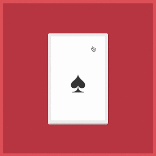

# Swing

A card swiping interface. The swipe-left/swipe-right for yes/no input. As seen in apps like [Jelly](http://jelly.co/) and [Tinder](http://www.gotinder.com/), and [many others](http://www.saydaily.com/2014/09/tinder-swipe-and-media).



## Quick Start

```js
var stack,
    cards = [].slice.call(document.querySelectorAll('.stack li'));

var stack;

stack = new Swing.Stack();

cards.forEach(function (targetElement) {
    stack.createCard(targetElement);
});

stack.on('throwout', function (e) {
    console.log(e.target.innerText, 'Card has been thrown out of the stack.');
    console.log(e.target.innerText, 'Throw direction: ' + (e.throwDirection == 1 ? 'right' : 'left'));
});

stack.on('snapback', function (e) {
    console.log(e.target.innerText, 'Card has snapped back to the stack.');

    e.target.classList.add('in-deck');
});
```

## Usage Examples

* [Card stack](http://gajus.com/sandbox/swing/examples/card-stack/).

The code for all of the examples is in the [./examples/](https://github.com/gajus/swing/tree/master/examples/) folder.

[Raise an issue](https://github.com/gajus/swing/issues) if you are missing an example.

## Dependencies

If you are using the `./dist/` version, you do not need to download the dependencies.

The list of the dependencies and description of their role is for your reference only.

* [Rebound](http://facebook.github.io/rebound-js/docs/rebound.html) to drive physical animations. Notice how if you drag too little and let go, the cards spring back into place.
* [Hammer](http://hammerjs.github.io/) to handle drag interactions.

## Todo

* Animate the card stack underneath the current card.